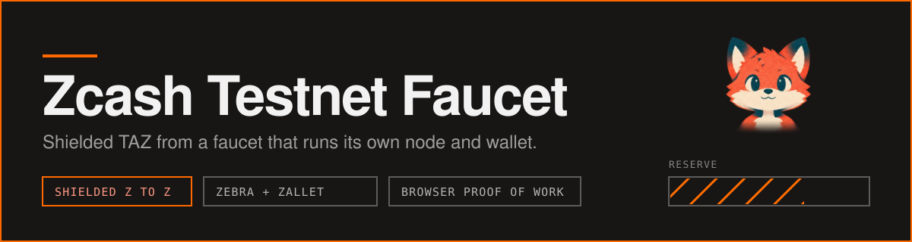
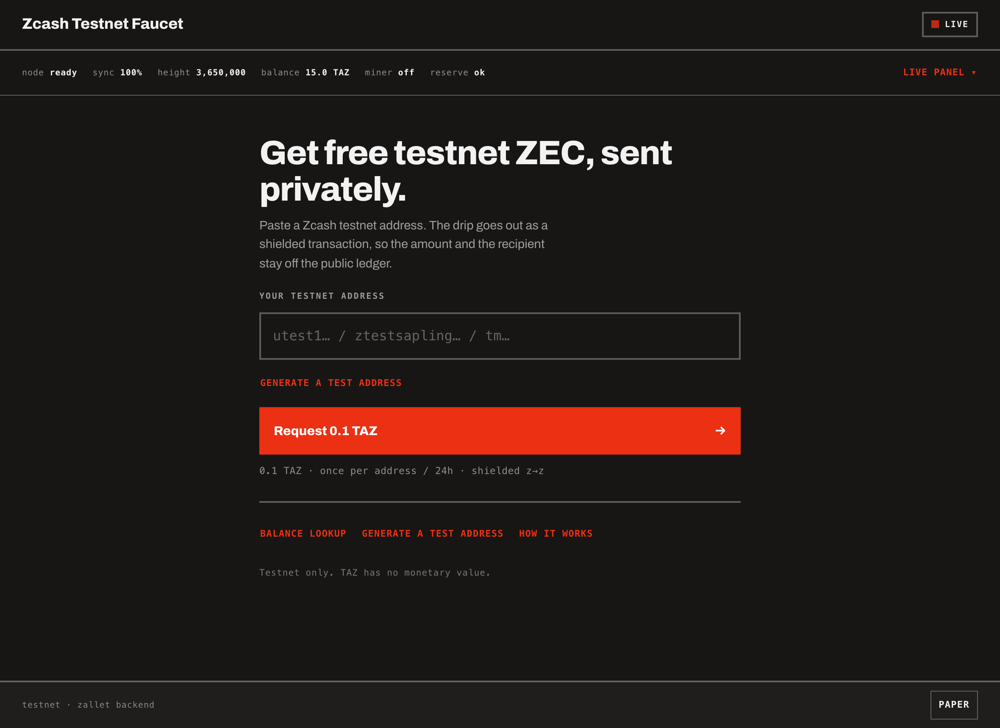
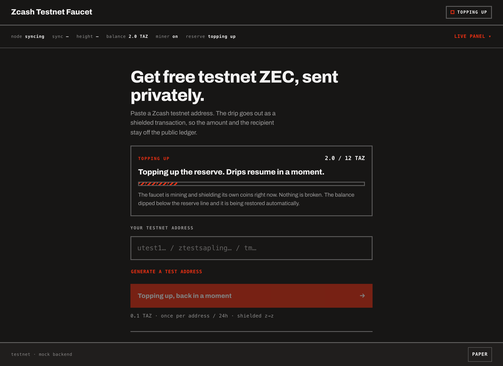
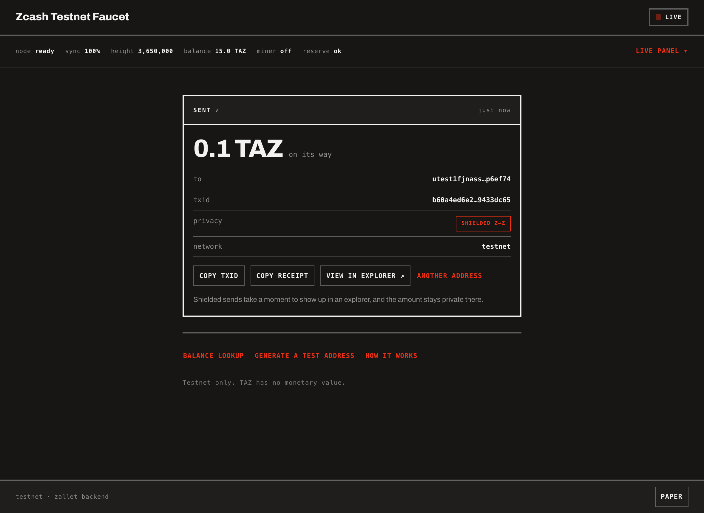
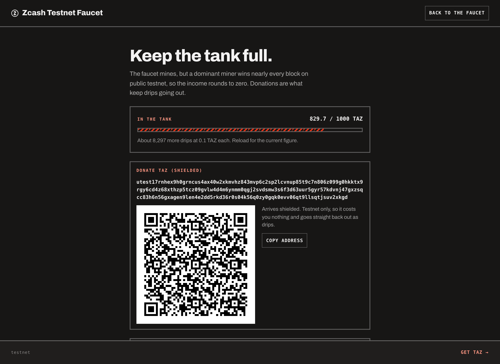

<picture>
  <source media="(prefers-color-scheme: light)" srcset="docs/banner-paper.svg">
  
</picture>

An open source Zcash testnet faucet you can run yourself. Paste an address,
solve a small proof-of-work in the browser, receive TAZ as a shielded z2z
transaction.

Most faucets are a wallet key and a form in front of somebody else's node. This
one owns its whole stack: a Zebra full node, a Zallet shielded wallet, a solo
miner, and a self-healing deployment. No third-party wallet service, no captcha
vendor, no external dependency in the path that moves money.

<picture>
  <source media="(prefers-color-scheme: light)" srcset="docs/screenshots/ready-paper.png">
  
</picture>

> `zcashd` reached end of life on 2026-07-18 and every node auto-halted. This
> project is built on what replaced it: **Zebra** (full node) and **Zallet**
> (wallet, with the Zaino indexer embedded).

## How it actually works

One box runs four things:

| Piece | What it does |
| --- | --- |
| **Zebra** | Full testnet node. Our own view of the chain, no trusted third party. |
| **Zallet** | Shielded wallet holding the faucet's Orchard notes. Pays via `z_sendmany` over JSON-RPC. Zaino is embedded, so there is no separate indexer process. |
| **Next.js app** | The faucet itself: claim endpoint, anti-abuse gate, reserve loop, UI. |
| **Caddy** | TLS and reverse proxy in front. |

A drip is a real shielded transaction. The faucet holds Orchard notes and pays
z2z, so the amount and the recipient stay off the public ledger, and so does the
link between the faucet and whoever claimed. Transparent recipients still work,
and the UI says plainly that those drips are public.

The public lightwalletd endpoint (`LIGHTWALLETD_ENDPOINT`) is now only used for
the read-side balance lookup tool. Nothing that moves money depends on it.

### Mining and the reserve loop

A solo CPU Equihash miner (`deploy/z3/miner`, Rust) works `getblocktemplate`
against our own Zebra, and a reserve loop (`src/lib/reserve/`) watches the
spendable balance: below the low-water mark it starts shielding mined coinbase
into the faucet's account, and it stops once the balance reaches target. Two
marks instead of one means the miner does not flap on and off. Refill work goes
through the same serial send queue as drips, one bounded step at a time, and
skips its turn whenever a real claim is waiting, so **topping up never pauses
service**.

That machinery works. The funding does not, and the reason is arithmetic rather
than a bug. We have mined real blocks that our own node accepted, but a single
dominant miner on public testnet wins every height and only ever extends its own
chain, so ours are orphaned. When one miner never builds on your blocks, your
chain advances only when you find a block and theirs advances when they do.
Below half their hashrate the long-run survival of any block you mine is **zero,
not merely small**, so no amount of tuning propagation or template freshness
changes the outcome. The measurement and the maths are in
[#42](https://github.com/jinolabs-xyz/zcash-faucet/issues/42).

What that means in practice: treat mining as machinery that is ready rather than
as an income stream. A deploy that needs a funded wallet has to get TAZ from
somewhere else for now. Mining costs almost nothing to leave running, so it
keeps running and would start funding the faucet the moment the network stops
being dominated by one miner.

### Anti-abuse

The **proof-of-work gate is built and live**, not a plan for later:

- The server issues a challenge signed with HMAC over `RATE_LIMIT_SALT`, so any
  instance can verify one with no shared store.
- The browser finds a nonce whose `sha256(seed:nonce)` has enough leading zero
  bits, in a worker so the tab never freezes.
- Difficulty adapts: a modest base, more bits for a client that keeps hammering,
  more again when the whole faucet is under load, hard-capped so a phone never
  gets a punishing wait.
- Each signed challenge is single use and bound to the salted IP fingerprint it
  was issued to, so a solution cannot be replayed or handed to someone else.

Cloudflare Turnstile is still supported for anyone who prefers it.
`FAUCET_CHALLENGE` picks: `pow`, `turnstile`, or `none`. PoW is the choice for a
self-sovereign deploy because it calls nobody and tracks no one.

Under the gate sit a per-address cooldown and a daily cap, enforced atomically in
one transaction so a burst of simultaneous requests cannot slip past. Rate
limiting is keyed on a **salted hash** of the IP (`src/lib/privacy.ts`), never
the raw address, and the raw IP never reaches a log line.

### The UI

One page (`src/app/page.tsx`), no tabs, with states that tell the truth about
what the backend is doing:

- **Preparing** while the node syncs, with real progress. You can queue a claim
  here and it sends itself once the node is ready.
- **Topping up** while the reserve loop refills. If the faucet can still serve it
  keeps serving and says so, because a healthy background refill must never look
  like an outage.
- **Empty** only when it genuinely cannot pay, and it says the wallet is refilled
  by hand rather than promising a self-heal that mining cannot deliver.
- **Ready**, then a receipt with the txid, a working explorer link, and a
  copyable plain-text summary.

<table>
  <tr>
    <td width="50%"></td>
    <td width="50%"></td>
  </tr>
  <tr>
    <td><b>Topping up.</b> A refill that can still serve keeps serving, and says so.</td>
    <td><b>Sent.</b> The receipt is the thing you paste into an issue.</td>
  </tr>
</table>

## Running it

[DEPLOY.md](DEPLOY.md) has both paths, local mock mode and a real server.
Settings are in [CONFIGURATION.md](CONFIGURATION.md), and
[CONTRIBUTING.md](CONTRIBUTING.md) covers working on it.

## How the tank stays full

The faucet is built to fund itself and to accept help, and it runs both legs at
once.

**It mines.** A solo Equihash miner and the reserve loop are wired end to end,
and the whole chain has run for real: a block we mined survived, the loop
shielded its coinbase on its own, and the faucet served a drip from it. On
public testnet a dominant miner takes most block races, so treat that leg as a
lottery ticket rather than a budget line
([the arithmetic](#mining-and-the-reserve-loop)). It costs almost nothing to
run and it pays when it pays.

**The community fills it.** Testnet TAZ has no market value, so topping up a
shared faucet is a small thing that keeps a tool available for everyone building
on Zcash. Donations arrive shielded at the unified address, and anyone with
spare hashrate can point a miner at the transparent one, which helps for the
same reason the race is currently lost: survival is about share.

Both addresses are optional config, surfaced on `/api/status` and on `/donate`.
`FAUCET_DONATION_ADDRESS` is the shielded one, `FAUCET_MINING_ADDRESS` the
transparent. Set neither and the pages that would show them say so rather than
rendering an empty box.

`/donate` is server rendered, so both addresses are readable with JavaScript
off. That is deliberate for a page whose only job is handing over an address
correctly.

## Operations

The box is meant to look after itself. Details live next to the scripts, this is
the map:

- **Self-healing.** A watchdog restarts wedged services. `/api/health` is
  liveness (is the process answering), `/api/ready` is readiness (can it actually
  serve a drip, with the reason when it cannot). Keeping those separate is what
  stops a normal first sync from looking like an outage.
- **Mining** and its tuning: [deploy/z3/MINING.md](deploy/z3/MINING.md)
- **Encrypted backups** of wallet and ledger: [deploy/z3/BACKUPS.md](deploy/z3/BACKUPS.md)
- **Snapshots** for a fast chain rebuild: [deploy/z3/SNAPSHOTS.md](deploy/z3/SNAPSHOTS.md)
- **TLS and domain**: [deploy/z3/HTTPS.md](deploy/z3/HTTPS.md)
- **Metrics and alerts**: [deploy/z3/OBSERVABILITY.md](deploy/z3/OBSERVABILITY.md)
- **Redeploy with rollback**, and external live monitoring: [deploy/](deploy/)

## How it is kept honest

Every merge is gated: typecheck, unit tests, route-level integration tests that
boot the built app and drive all six endpoints, an end-to-end smoke of the claim
flow, shellcheck plus a harness over the deploy scripts, and the miner's own
`cargo test` and clippy. Branch protection means nothing merges red.

The money path carries the coverage it deserves. The send queue is proven to
serialise under a concurrent burst, a proof-of-work challenge is proven to stay
spent across a restart, and a send whose outcome we cannot observe is proven not
to hand out a second drip. Tests that only pass are not enough on this repo:
behaviour gets exercised, adversarially where funds or user trust are involved.

## Testnet only

TAZ has no monetary value. Never point this at mainnet, and never reuse a testnet
key anywhere real.
