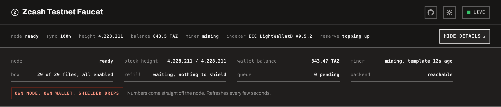
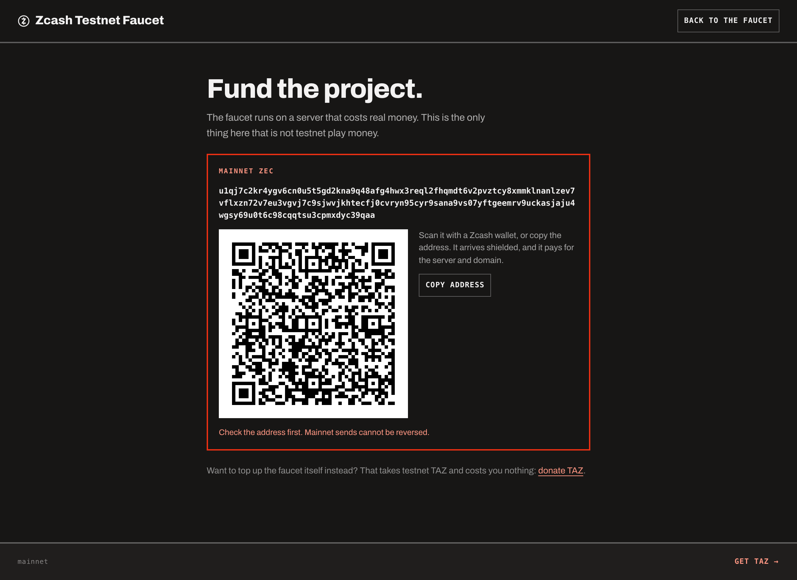
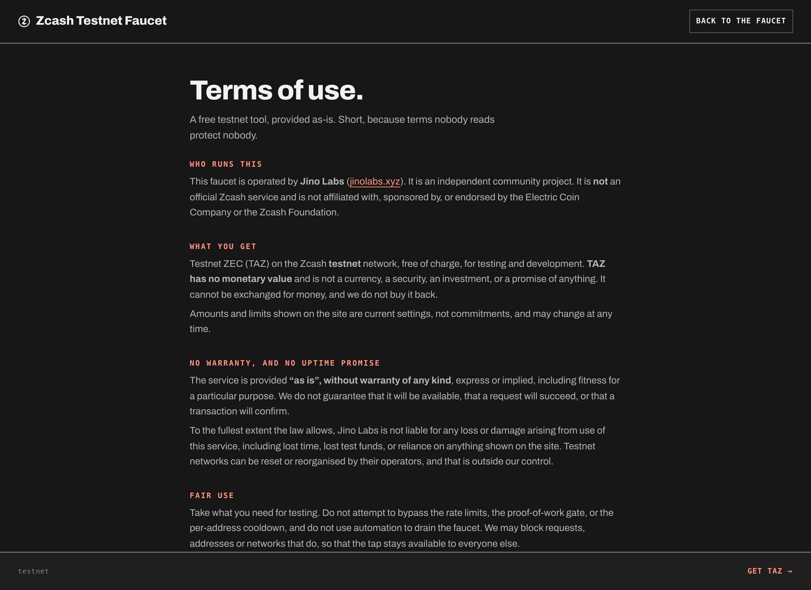

<picture>
  <source media="(prefers-color-scheme: light)" srcset="docs/banner-paper.svg">
  
</picture>

An open source Zcash testnet faucet you can run yourself. Paste an address,
solve a small proof-of-work in the browser, receive TAZ as a shielded z2z
transaction.

Running instance: **[zcashfaucet.jinolabs.xyz](https://zcashfaucet.jinolabs.xyz)**

Most faucets are a wallet key and a form in front of somebody else's node. This
one owns its whole stack: a Zebra full node, a Zallet shielded wallet, a solo
miner, and a self-healing deployment. No third-party wallet service, no captcha
vendor, no external dependency in the path that moves money.

The property it is actually built around: **it refuses rather than guesses, and it
says so when it cannot tell.** The faucet will not build a payment its node is too far
behind to confirm, the deploy will not report success without checking what it left
behind, and every status field distinguishes "working" from "broken" from "I cannot
see". Most of the engineering below is that one idea applied in different places, each
one learned from a specific failure.

<picture>
  <source media="(prefers-color-scheme: light)" srcset="docs/screenshots/ready-paper.png">
  
</picture>

> `zcashd` reached end of life on 2026-07-18 and every node auto-halted. This
> project is built on what replaced it: **Zebra** (full node) and **Zallet**
> (wallet, with the Zaino indexer embedded).

> **Running post-Ironwood.** NU6.3 (Ironwood) is active on our testnet from
> height 4,134,000, and the wallet's notes live in the corrected Ironwood pool,
> not the sealed Orchard one. The faucet has minted and paid shielded drips on
> the new pool for weeks, and it was running on the corrected circuit before
> mainnet's own Ironwood activation on 2026-07-28 rather than after it.

## How it actually works

One box runs four things:

| Piece | What it does |
| --- | --- |
| **Zebra** | Full testnet node. Our own view of the chain, no trusted third party. |
| **Zallet** | Shielded wallet holding the faucet's Ironwood-pool notes. Pays via `z_sendmany` over JSON-RPC. Zaino is embedded, so there is no separate indexer process. |
| **Next.js app** | The faucet itself: claim endpoint, anti-abuse gate, reserve loop, UI. |
| **Caddy** | TLS and reverse proxy in front. |

A drip is a real shielded transaction. The faucet holds Ironwood-pool notes and
pays z2z, so the amount and the recipient stay off the public ledger, and so does the
link between the faucet and whoever claimed. Transparent recipients still work,
and the UI says plainly that those drips are public.

The public lightwalletd endpoint (`LIGHTWALLETD_ENDPOINT`) is now only used for
the read-side balance lookup tool. Nothing that moves money depends on it.

### Mining and the reserve loop

A solo CPU Equihash miner (`deploy/z3/miner`, Rust) works `getblocktemplate`
against our own Zebra, and a reserve loop (`src/lib/reserve/`) watches the
spendable balance: below the low-water mark it starts shielding mined coinbase
into the faucet's account, and it stops once the balance reaches target. Two
marks instead of one means the miner does not flap on and off. Refill work goes
through the same serial send queue as drips, one bounded step at a time, and
skips its turn whenever a real claim is waiting, so **topping up never pauses
service**.

**It does win, and not often enough to be a budget.** On 2026-07-31 the miner solved
and had accepted blocks 4,227,889 and 4,227,915 six minutes apart, paying 2.5 TAZ of
coinbase. That is real income and it is the first this project has earned.

It does not overturn the arithmetic, which is why this section still exists. A single
dominant miner on public testnet takes most heights and extends its own chain, so a
small miner's blocks are usually orphaned. The measurement and the maths are in
[#42](https://github.com/jinolabs-xyz/zcash-faucet/issues/42). Two wins in six minutes
is luck as much as hashrate, and the honest read is that mining is a lottery ticket
that occasionally pays rather than a line in a budget.

So: **donations fund the faucet, mining supplements it.** Mining costs nothing extra
on a box already paid for, the miner runs at the lowest priority so it yields to
serving traffic, and it stays on permanently. Spare cycles that occasionally produce
1.25 TAZ are worth having; planning around them is not.

Coinbase needs 100 confirmations to mature before it can be shielded, so a won block
turns into spendable shielded balance about two hours later, unattended.

### Anti-abuse

The **proof-of-work gate is built and live**, not a plan for later:

- The server issues a challenge signed with HMAC over `RATE_LIMIT_SALT`, so any
  instance can verify one with no shared store.
- The browser finds a nonce whose `sha256(seed:nonce)` has enough leading zero
  bits, in a worker so the tab never freezes.
- Difficulty adapts: a modest base, more bits for a client that keeps hammering,
  more again when the whole faucet is under load, hard-capped so a phone never
  gets a punishing wait.
- Escalation is keyed on the **subnet as well as the address**. A cloud provider
  hands one person thousands of addresses in a /24, so counting only the address
  meant fifty attempts from fifty addresses looked like fifty first-time users
  and the farmer paid the base difficulty forever. The two counters are combined
  with `max` rather than a sum, so a single honest claimer is never charged twice
  for the same attempt.
- Each signed challenge is single use and bound to the salted IP fingerprint it
  was issued to, so a solution cannot be replayed or handed to someone else.
- The attempt counter increments **after** the signature check, never before.
  Otherwise anyone could raise the difficulty for a whole /24 they do not belong
  to, including a shared office, by posting junk.

Cloudflare Turnstile is still supported for anyone who prefers it.
`FAUCET_CHALLENGE` picks: `pow`, `turnstile`, or `none`. PoW is the choice for a
self-sovereign deploy because it calls nobody and tracks no one.

Under the gate sit a per-address cooldown and a daily cap, enforced atomically in
one transaction so a burst of simultaneous requests cannot slip past. Rate
limiting is keyed on a **salted hash** of the IP (`src/lib/privacy.ts`), never
the raw address, and the raw IP never reaches a log line.

### Knowing the chain is real, and that a payment can still confirm

Owning the node removes the trusted third party. It does not by itself tell you
the node is right, so the faucet checks its own view rather than assuming it.

- **Freshness gates the money path.** Zcash transactions carry an expiry height
  set from the tip our node reports. A node lagging far enough builds
  transactions that are already expired when they are broadcast, so they can
  never be mined. The faucet compares its tip against an independent reference
  and **refuses to build a payment** when the gap is too wide, rather than
  issuing one that cannot confirm. `node.shield` and `node.canBuildTx` on
  `/api/status` are that decision, and they are separate from the much looser
  "is the node broadly behind" signal on purpose: one asks about availability,
  the other about money.
- **Ahead is not the same as agreeing.** A node in front of every external
  reference looks identical to a node on its own fork. Being ahead is safe for
  an expiry height, since ahead cannot be stale, and it is not evidence that we
  are on the same chain as everyone else. The status reason says so in those
  words rather than reporting a comfortable "in sync".
- **Same rules.** The consensus branch id our node reports is compared against
  an independent source, which catches a missed network upgrade. Reported as
  `node.chain`.
- **Same history** is the half that is not finished. Comparing a block hash at a
  common height is what would actually detect a chain split, and it needs a
  lookup neither side exposes to us yet, so it honestly reports `cannot-verify`
  instead of a reassuring answer it has not earned.
- **Payouts are confirmed by somebody else.** Asking our own node whether our own
  transaction landed proves very little, so confirmation goes to an independent
  source. A payout past its expiry height is reported as permanently unmineable,
  which is a decidable fact rather than a guess.

Throughout, a source that will not answer is recorded as **cannot verify**, never
as a pass. An unreachable explorer is not evidence of a fork, and a check that
cannot run must not read the same as one that ran and found nothing wrong.

### What the status actually reports

Every number on the page comes off the node, and every state is a claim the system can
defend. The distinction that took the longest to learn: **"working", "broken" and "I
cannot tell" are three different answers, and only one of them is good news.**

That is production, not a mock. `box 28 of 28 files, all enabled` is the integrity gate
answering over the scripts and units it tracks; `miner mining, template 4s ago` is a
heartbeat file written by the miner itself, not an environment variable; `refill
waiting, nothing to shield` is the reserve loop distinguishing patience from failure.
Every row is a measurement, and each one covers exactly what it says and no more.

- **The miner reports template activity, not a config flag.** `miner: on` used to be
  `FAUCET_MINER_ACTIVE === "true"`, an env var, which cannot be false while the miner
  is broken. It read `on` for 70 minutes while the miner errored every five seconds on
  a stale RPC cookie. It now says `mining, template 14s ago`, or names the stall, or
  says it cannot see the heartbeat at all.
- **Not-configured and unreadable are different findings.** No heartbeat path means
  nobody asked the app to look, and the deploy fixes it. A path with nothing readable
  means it is wired up and the writer is dead, and the box fixes it. Collapsing those
  throws away which of two jobs an operator has.
- **The reserve loop says whether it is waiting or failing.** "Insufficient balance"
  from `z_shieldcoinbase` usually means the coinbase is not 100 blocks old yet, which
  is normal. It reads `waiting, nothing to shield`, not an error, and a real failure is
  named as one.
- **A refill that can still serve keeps serving and says so**, because a healthy
  background top-up must never look like an outage.

### The UI

One page (`src/app/page.tsx`), no tabs, with states that tell the truth about
what the backend is doing:

- **Preparing** while the node syncs, with real progress. You can queue a claim
  here and it sends itself once the node is ready.
- **Topping up** while the reserve loop refills. If the faucet can still serve it
  keeps serving and says so, because a healthy background refill must never look
  like an outage.
- **Empty** only when it genuinely cannot pay, and it says the wallet is refilled
  by hand rather than promising a self-heal that mining cannot deliver.
- **Ready**, then a receipt with the txid, a working explorer link, and a
  copyable plain-text summary.

<table>
  <tr>
    <td width="50%"></td>
    <td width="50%"></td>
  </tr>
  <tr>
    <td><b>Topping up.</b> A refill that can still serve keeps serving, and says so.</td>
    <td><b>Sent.</b> The receipt is the thing you paste into an issue.</td>
  </tr>
</table>

Behind **More details** is the operator's instrument: node, block height, wallet
balance, miner with the age of its last template, box integrity, refill, queue and
backend. All of it live off the node, one line each, with rows that need attention
marked so five alarming rows and four fine ones do not read the same.

Light and dark are a toggle in the masthead, and the choice is remembered and repaints
the browser's own chrome so the address bar matches the page. The source is linked
from the masthead too.

There are three other pages, and they are separate on purpose:

| page | why it is its own page |
| --- | --- |
| `/donate` | testnet TAZ that goes back out as drips |
| `/fund` | **mainnet ZEC** for running costs |
| `/terms` | who operates this, and on what basis |

`/donate` and `/fund` are split because both are unified shielded addresses that
differ only in **which network eats your money if you pick wrong**. Side by side, the
entire defence against that was a border colour and the word "mainnet". One page, one
network is a defence that does not depend on reading carefully.

<table>
  <tr>
    <td width="50%"></td>
    <td width="50%"></td>
  </tr>
  <tr>
    <td><b>Donate TAZ.</b> Testnet, costs the giver nothing, goes back out as drips.</td>
    <td><b>Fund the project.</b> Mainnet, real money, and the only page on the site outlined in red.</td>
  </tr>
</table>

Both carry a QR encoding a ZIP-321 `zcash:` URI rather than a bare address string, so a
wallet opens a prefilled send instead of a search box. They are generated server side,
so nothing leaves the browser to draw them and no third party learns who read the page.
Each is sized for about four device pixels per module and always renders black on
white, because an inverted code fails on some phone cameras and a code that does not
scan is decoration. The first version was 2.2 pixels per module and did not scan in
Zashi at all.

`/terms` says who operates the faucet and on what basis, including that it is provided
as is, that donations are not refundable, and that trademarks belong to their owners.

## Running it

[DEPLOY.md](DEPLOY.md) has both paths, local mock mode and a real server.
Settings are in [CONFIGURATION.md](CONFIGURATION.md), and
[CONTRIBUTING.md](CONTRIBUTING.md) covers working on it.

## How the tank stays full

The faucet is built to fund itself and to accept help, and it runs both legs at
once.

**It mines.** A solo Equihash miner and the reserve loop are wired end to end,
and the whole chain has run for real: a block we mined survived, the loop
shielded its coinbase on its own, and the faucet served a drip from it. On
public testnet a dominant miner takes most block races, so treat that leg as a
lottery ticket rather than a budget line
([the arithmetic](#mining-and-the-reserve-loop)). It costs almost nothing to
run and it pays when it pays.

**The community fills it.** Testnet TAZ has no market value, so topping up a
shared faucet is a small thing that keeps a tool available for everyone building
on Zcash. Donations arrive shielded at the unified address, and anyone with
spare hashrate can point a miner at the transparent one, which helps for the
same reason the race is currently lost: survival is about share.

Both addresses are optional config, surfaced on `/api/status` and on `/donate`.
`FAUCET_DONATION_ADDRESS` is the shielded one, `FAUCET_MINING_ADDRESS` the
transparent. Set neither and the pages that would show them say so rather than
rendering an empty box.

Both pages are server rendered, so the addresses are readable with JavaScript off. That
is deliberate for pages whose only job is handing over an address correctly, and it is
why [`/fund`](src/app/fund/page.tsx) is explicitly `force-dynamic`: without it Next
would prerender at build time and ship a funding page with no address on it.

## Operations

The interesting property is not that these exist. It is that **none of them report
success without checking the state they left behind**, and that a check which cannot
run reports "cannot verify" rather than passing.

That rule was learned the hard way. Every item below is a specific failure this
project had, and the guard that now prevents it.

### The box has to prove it matches the repo

`deploy/z3/box-report.sh` publishes what is actually installed, `/api/status` turns it
into a verdict, and the external smoke probe **fails CI when it does not match**.

**`unknown` fails the gate**, which is the whole point: a box that cannot say what it
has was the state we were actually in, and treating silence as success is what let 19
of 25 required files sit uninstalled for weeks, `audit-drift.sh` among them. The
detector for that failure was one of the files that never installed.

Installed-but-not-enabled counts as a failure too, because it works until the next
reboot and then silently does not. A `.service` activated by its own `.timer` is
exempt, since `disabled` is correct there.

The reporting timer has to be enabled once per box, because the installer places units
and deliberately does not start them. Until someone does, the mechanism is present and
inert, which is exactly the condition it exists to catch, so the gate reads `unknown`
and fails rather than assuming the best. Production currently reads **28 of 28 tracked
scripts and units, all enabled**, and that number is on the page rather than in a log.

Read that scope literally. The count covers the scripts and systemd units the repo
tracks. **The compiled miner binary is outside it**, which is the gap named below, so a
green box row is not a statement about the miner. Saying "28 of 28 files" without the
qualifier would make it a check that cannot fail about something it appears to cover,
which is the exact shape of the `FAUCET_MINER_ACTIVE` bug this project spent a week
removing. It publishes the integrity of what it tracks, and the honest version says so.

### Deploys refuse rather than report

`deploy/deploy.sh` will not:

- **drop an HTTPS box to plain HTTP.** It reads the domain from `/etc/faucet-domain`
  and refuses when it would pass `:80` to the proxy. Unset, that took the site down
  for ten hours: HSTS with a one-year max-age means every browser that has ever
  visited refuses to fall back, while every container still reads healthy.
- **replace a wallet account that is already configured.** A generated account
  overwriting a funded one made 758 TAZ invisible to the faucet. Create-if-absent,
  never overwrite.
- **exit without asserting the end state.** HTTPS answers on the configured domain,
  the wallet accepts the new credential and **rejects a deliberately wrong one**, and
  the account is the one the run started with.

That negative control matters: a probe that only ever sees 200 cannot tell
authentication from a server saying yes to everything.

### The installer cannot silently do nothing

`install-ops.sh` takes its source explicitly and **refuses when source and destination
resolve to the same path**. The version before it inferred the source from its own
location, so running the installed copy globbed the install directory, compared every
file to itself, installed nothing, and printed `done: 0 installed, N already current`.

It now compares every file at the destination against the repo and exits non-zero on a
mismatch. The loop finishing is not the files being there.

It installs scripts and unit files. The compiled miner binary is still built by hand
(`cargo build --release`, then copy), so a fresh box is not fully to spec after one
command. That is a known gap and it is named here rather than rounded up.

The ops scripts have their own test harness, **688 assertions, 688 passed**, measured
against `origin/main` rather than a feature branch. It **refuses to run rather than
return a number it cannot stand behind**, and the two refusals are different failures:

- **Without GNU `find` and `stat`**, roughly 85 assertions fail as though the code were
  broken. Noisy, but honest noise.
- **Without `sha256sum`**, one assertion passes **green** while checking nothing, because
  the drift check compares two listings that are both empty and equal. That is the
  dangerous one, and it is why the refusal exists: this is the case where the suite would
  have lied rather than complained. Both tend to co-occur on macOS, which ships `shasum`
  instead.
- **The watchdog suite alone declines to run as root**, because root can write to the
  directory the test just made unwritable, so the degrade path never executes and the
  watchdog looks fine. The scoping is deliberate: `SUITES=drift` runs as root and
  passes. Refusing suites that would have run correctly is its own kind of dishonesty.

A test suite that answers wrongly is worse than one that says it cannot answer.

### Credentials rotate, and the rotation is proven both ways

The wallet RPC password moved from plaintext to `pwhash`, and migrating **rotates**
rather than hashing the existing value, so a credential that has been through a log
stops working. Verified against the **running wallet**, not the config files: the new
password authenticates and the old one is rejected. Config and wallet agreeing on disk
is not the wallet agreeing.

### Versions are pinned where they can be reviewed

`deploy/z3/stack-versions.env` pins the node by version and the **wallet by digest**,
because a tag can be re-pushed and a digest cannot, and the wallet is a third-party
build holding the faucet's funds. `audit-drift.sh` compares the pins against what is
actually running, so a box that drifts is reported rather than discovered.

### Backups: the procedure is verified, the production archives are not

Encrypted wallet and ledger backups run on a timer and are ~22 MB. The restore path has
been exercised end to end against a wallet created by the real `zallet` binary: it
round-tripped logically identical, 42 tables and 62 rows, with matching content digests.

What has **not** been restored is the production archives with the box's own passphrase.
Those are two different claims and it would be us conflating them to write only the
first. A restore procedure that works on a test wallet tells you the code is right; it
does not tell you that the file sitting on this box tonight can be opened.

### Where the details live

- **Mining** and its tuning: [deploy/z3/MINING.md](deploy/z3/MINING.md), and
  [TESTNET-MINING.md](TESTNET-MINING.md) walks a newcomer through mining a first block
- **Encrypted backups**: [deploy/z3/BACKUPS.md](deploy/z3/BACKUPS.md)
- **Snapshots** for a fast chain rebuild: [deploy/z3/SNAPSHOTS.md](deploy/z3/SNAPSHOTS.md)
- **TLS and domain**: [deploy/z3/HTTPS.md](deploy/z3/HTTPS.md)
- **Metrics and alerts**: [deploy/z3/OBSERVABILITY.md](deploy/z3/OBSERVABILITY.md)
- **Redeploy with rollback**, and external live monitoring: [deploy/](deploy/)

## How it is kept honest

Every merge is gated: typecheck, unit tests, route-level integration tests that
boot the built app and drive all six endpoints, an end-to-end smoke of the claim
flow, shellcheck plus a harness over the deploy scripts, and the miner's own
`cargo test` and clippy. Branch protection means nothing merges red.

The money path carries the coverage it deserves. The send queue is proven to
serialise under a concurrent burst, a proof-of-work challenge is proven to stay
spent across a restart, and a send whose outcome we cannot observe is proven not
to hand out a second drip. Tests that only pass are not enough on this repo:
behaviour gets exercised, adversarially where funds or user trust are involved.

## Testnet only

TAZ has no monetary value. Never point this at mainnet, and never reuse a testnet
key anywhere real.
